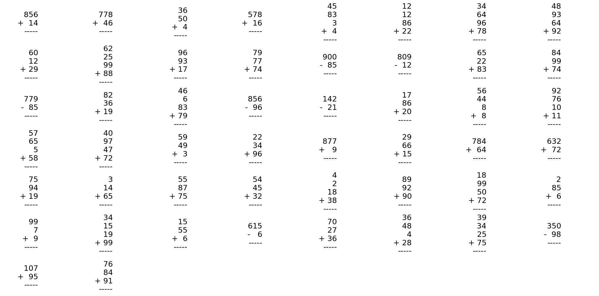

# LaTeX Math Problem Generator

This repository contains two Python scripts to generate and convert LaTeX arithmetic problems into images.


An example LaTeX output file: [`output.tex`](output.tex)
An example image output file: [`output.jpg`](output.jpg)

## `genlatex.py`

This script generates a LaTeX document containing various arithmetic problems (addition, subtraction, or a mix) formatted for vertical calculation.

### Usage

```bash
python genlatex.py <operation_type> [OPTIONS]
```

- `<operation_type>`: `plus`, `minus`, or `mix`.
- `-o, --output <filename>`: Output file name for the LaTeX document (default: `output.tex`).
- `-s, --stack_height <height>`: Maximum number of operands (2 to 4, default: 4).
- `-t, --total_problems <count>`: Total number of problems to generate (default: 50).

### Examples

Generate 50 addition problems with a maximum of 4 numbers per problem:
```bash
python genlatex.py plus
```

Generate 100 mixed problems with 2 operands, saving to `my_problems.tex`:
```bash
python genlatex.py mix -s 2 -t 100 -o my_problems.tex
```

## `latex_to_image.py`

This script reads a LaTeX file generated by `genlatex.py` (or any file containing LaTeX math `array` environments) and converts the math problems into a single image file. It uses Matplotlib's internal mathtext engine, avoiding the need for an external LaTeX installation.

### Usage

```bash
python latex_to_image.py <input_file> <output_file>
```

- `<input_file>`: Path to the input LaTeX file.
- `<output_file>`: Path for the output image file (e.g., `problems.png`, `problems.jpg`).

### Examples

Convert `output.tex` to `problems.png`:
```bash
python latex_to_image.py output.tex problems.png
```

First, generate a LaTeX file, then convert it to an image:
```bash
python genlatex.py plus -o temp_problems.tex
python latex_to_image.py temp_problems.tex addition_problems.png
```
